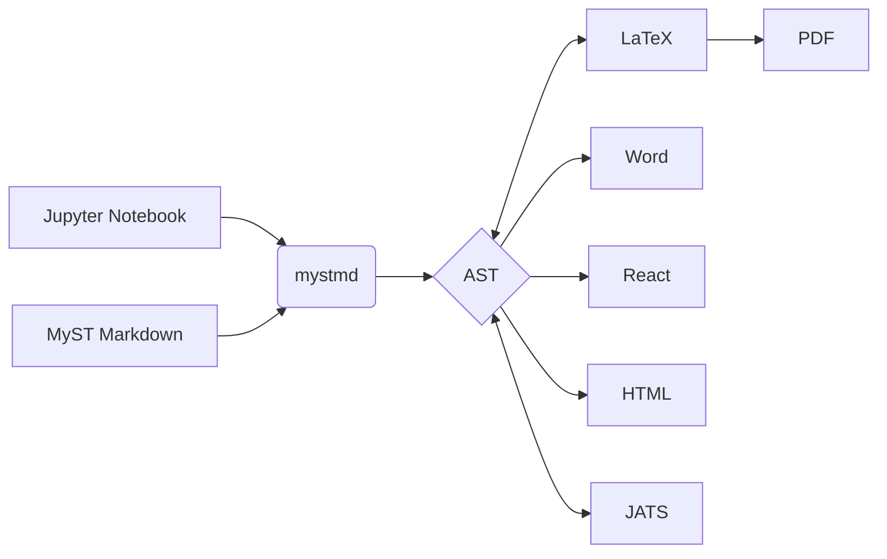

# hello world

```py
import time
for x in range(0,100):
    print(f"hello {x}")
    time.sleep(1)
```

```
.. toctree::

   usage
   test
   api
```

:::{admonition} Here's my title
:class: tip

Here's my admonition content.{sup}`1`
:::

(header-label)=
# A header

[My reference](#header-label)

# what is this

dont know what is is.

# first

```{mermaid}
flowchart LR
  A[Jupyter Notebook] --> C
  B[MyST Markdown] --> C
  C(mystmd) --> D{AST}
  D <--> E[LaTeX]
  E --> F[PDF]
  D --> G[Word]
  D --> H[React]
  D --> I[HTML]
  D <--> J[JATS]
```

# second 

